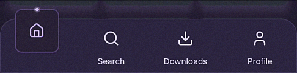

# SqNav 🚀

[](https://jitpack.io/#Ahmed-El-Gendy/sqnav)
[](https://opensource.org/licenses/MIT)
[](https://android-arsenal.com/api?level=24)
[](https://kotlinlang.org)
[](https://developer.android.com/jetpack/compose)

A modern, fluid, and highly customizable **Squircle Bottom Navigation Bar** for Android with floating elevated card transitions and glowing neon flash indicators.

<p align="center">
  
</p>

---

## ✨ Features

- 🌟 **Floating Squircle Card**: Elevated active state with smooth spring overshoot animations.
- ⚡ **Neon Flash Indicator**: Multi-layer glowing spark that sits on top of the active tab.
- 🎨 **Full Styling Control**: Customizable background, card size, stroke border, corner radius, and glow colors via XML or code.
- 🔄 **Universal Support**: Works seamlessly with **Java**, **Kotlin**, and **Jetpack Compose**.
- 🚀 **Zero Bloat**: Lightweight, efficient, and ProGuard-optimized.

---

## 📦 Installation

### Step 1: Add JitPack repository

In your `settings.gradle.kts` (or root `build.gradle`):

```kotlin
dependencyResolutionManagement {
    repositoriesMode.set(RepositoriesMode.FAIL_ON_PROJECT_REPOS)
    repositories {
        google()
        mavenCentral()
        maven(url = "https://jitpack.io")
    }
}
```

### Step 2: Add the dependency

In your app module `build.gradle.kts`:

```kotlin
dependencies {
    implementation("com.github.Ahmed-El-Gendy:sqnav:v1.0.0")
}
```

---

## 💻 Usage Guides

### 1. Jetpack Compose

```kotlin
import androidx.compose.foundation.layout.fillMaxWidth
import androidx.compose.foundation.layout.height
import androidx.compose.runtime.*
import androidx.compose.ui.Modifier
import androidx.compose.ui.unit.dp
import androidx.compose.ui.viewinterop.AndroidView
import com.sagendy.sqnav.SqNav
import com.sagendy.sqnav.SqNavItem

@Composable
fun SqNavBottomBar(
    selectedItemId: Int,
    onItemSelected: (Int) -> Unit,
    modifier: Modifier = Modifier
) {
    AndroidView(
        modifier = modifier
            .fillMaxWidth()
            .height(72.dp),
        factory = { context ->
            SqNav(context).apply {
                addItem(SqNavItem(1, "Home", R.drawable.ic_home))
                addItem(SqNavItem(2, "Search", R.drawable.ic_search))
                addItem(SqNavItem(3, "Downloads", R.drawable.ic_downloads))
                addItem(SqNavItem(4, "Profile", R.drawable.ic_profile))

                setOnItemSelectedListener { itemId ->
                    onItemSelected(itemId)
                }
            }
        },
        update = { sqNav ->
            sqNav.setSelectedItemId(selectedItemId, true)
        }
    )
}
```

---

### 2. Kotlin (Views / ViewBinding)

```kotlin
val sqNav = findViewById<SqNav>(R.id.bottomNav)

// Add tabs
sqNav.addItem(SqNavItem(1, "Home", R.drawable.ic_home))
sqNav.addItem(SqNavItem(2, "Search", R.drawable.ic_search))
sqNav.addItem(SqNavItem(3, "Downloads", R.drawable.ic_downloads))
sqNav.addItem(SqNavItem(4, "Profile", R.drawable.ic_profile))

// Handle selection
sqNav.setOnItemSelectedListener { itemId ->
    when (itemId) {
        1 -> showHome()
        2 -> showSearch()
        3 -> showDownloads()
        4 -> showProfile()
    }
}
```

---

### 3. Java & XML Layout

#### In XML:
```xml
<com.sagendy.sqnav.SqNav
    android:id="@+id/bottomNav"
    android:layout_width="match_parent"
    android:layout_height="72dp"
    android:layout_gravity="bottom"
    app:sq_backgroundColor="#231C30"
    app:sq_backgroundRadius="10dp"
    app:sq_cardColor="#231C34"
    app:sq_cardStrokeColor="#4E3B70"
    app:sq_cardRadius="2.7dp"
    app:sq_cardSize="58dp"
    app:sq_selectedColor="#D4BBFF"
    app:sq_unselectedColor="#E0DCF0"
    app:sq_glowDotColor="#D4BBFF"
    app:sq_showGlowDot="true" />
```

#### In Java:
```java
SqNav sqNav = findViewById(R.id.bottomNav);

sqNav.addItem(new SqNavItem(1, "Home", R.drawable.ic_home));
sqNav.addItem(new SqNavItem(2, "Search", R.drawable.ic_search));
sqNav.addItem(new SqNavItem(3, "Downloads", R.drawable.ic_downloads));
sqNav.addItem(new SqNavItem(4, "Profile", R.drawable.ic_profile));

sqNav.setOnItemSelectedListener(itemId -> {
    // switch tab
});

sqNav.setSelectedItemId(1, false);
```

---

## 🎨 Customizable Attributes

| Attribute | Format | Default | Description |
|---|---|---|---|
| `app:sq_backgroundColor` | color | `#231C30` | Navigation bar background color |
| `app:sq_backgroundRadius` | dimension | `20dp` | Top corner radius of the navbar |
| `app:sq_cardColor` | color | `#231C30` | Floating squircle card background color |
| `app:sq_cardStrokeColor` | color | `#4E3B70` | Border stroke color around the squircle card |
| `app:sq_cardRadius` | dimension | `8dp` | Corner radius of the squircle card |
| `app:sq_cardSize` | dimension | `58dp` | Width & height of the floating squircle card |
| `app:sq_selectedColor` | color | `#D4BBFF` | Selected icon & active glow accent color |
| `app:sq_unselectedColor` | color | `#E0DCF0` | Inactive icons and labels color |
| `app:sq_glowDotColor` | color | `#D4BBFF` | Top neon flash indicator dot color |
| `app:sq_showGlowDot` | boolean | `true` | Show or hide the top neon glow dot |

---

## 🤝 Contributing

Contributions are warmly welcome! If you have suggestions, new animation styles, or bug fixes, feel free to open an Issue or submit a Pull Request.

---

## 📄 License

```
Copyright (c) 2026 Ahmed El-Gendy

Licensed under the MIT License.
```
